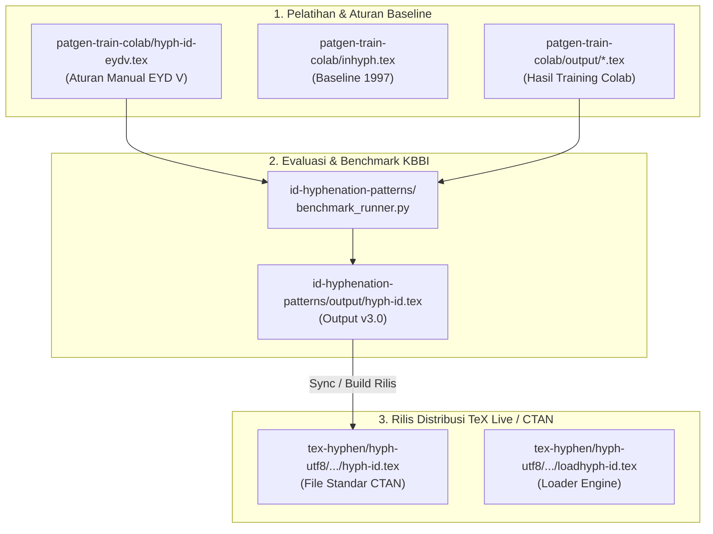

### 1. Ringkasan & Jawaban Langsung

> [!IMPORTANT]
> **Apakah perlu dikumpulkan dalam satu folder secara fisik?**
> **TIDAK/BELUM PERLU dipindahkan secara manual.** 
> 
> Penjelasannya: File-file `.tex` tersebut berada di dalam **repositori Git yang berbeda** dengan **fungsi dan tahap pipeline yang berbeda pula** (Upstream CTAN, Training Patgen, Benchmark, & Legacy). Memindahkan file-file ini ke dalam satu folder fisik di root akan **mengacaukan struktur standar TeX Live (`hyph-utf8`)** dan merusak pelacakan Git (*version control*).

Namun, secara **tata kelola (architecture & management)**, file-file ini **sangat perlu dikatalogkan dan disinkronkan menggunakan skrip otomatis (*automation build/export script*)** agar tidak terjadi kebingungan mengenai mana file *Single Source of Truth* (SSOT).

---

### 2. Audit Inventaris File TeX Bahasa Indonesia

Berdasarkan pemindaian codebase, ditemukan **9 file `.tex`** Bahasa Indonesia yang tersebar di 3 repositori utama:

| No | Lokasi File | Versi / Jenis | Ukuran | Peran & Deskripsi |
| :--- | :--- | :--- | :--- | :--- |
| 1 | [`id-hyphenation-patterns/output/hyph-id.tex`](file:///c:/Users/aknpa/dev/bahasa/pattern/id-hyphenation-patterns/output/hyph-id.tex) | **v3.0** (2025) | ~162 KB | **Kandidat Main Output**: Hasil kompilasi *orthos.js* berbasis KBBI (72.000+ kata). |
| 2 | [`id-hyphenation-patterns/output/hyph-id-new.tex`](file:///c:/Users/aknpa/dev/bahasa/pattern/id-hyphenation-patterns/output/hyph-id-new.tex) | **v1.0** (Draft) | ~1.97 MB | **Raw Generated**: File pola eksperimental ukuran besar dari ekspor direktori. |
| 3 | [`tex-hyphen/hyph-utf8/tex/generic/hyph-utf8/patterns/tex/hyph-id.tex`](file:///c:/Users/aknpa/dev/bahasa/pattern/tex-hyphen/hyph-utf8/tex/generic/hyph-utf8/patterns/tex/hyph-id.tex) | **v2.0** (2025) | ~848 KB | **Upstream Standard**: File standar untuk rilis paket TeX Live / CTAN (`hyph-utf8`). |
| 4 | [`tex-hyphen/hyph-utf8/tex/generic/hyph-utf8/loadhyph/loadhyph-id.tex`](file:///c:/Users/aknpa/dev/bahasa/pattern/tex-hyphen/hyph-utf8/tex/generic/hyph-utf8/loadhyph/loadhyph-id.tex) | Loader | ~1.3 KB | **TeX Engine Loader**: File pembaca pola untuk XeTeX/LuaTeX/pdfTeX. |
| 5 | [`patgen-train-colab/hyph-id-eydv.tex`](file:///c:/Users/aknpa/dev/bahasa/pattern/patgen-train-colab/hyph-id-eydv.tex) | **EYD V** (2024) | ~8.6 KB | **Manual Rule Baseline**: Aturan pola pemenggalan manual berbasis EYD Edisi V (2022). |
| 6 | [`patgen-train-colab/output/hyph-id-compact.tex`](file:///c:/Users/aknpa/dev/bahasa/pattern/patgen-train-colab/output/hyph-id-compact.tex) | Patgen Compact | ~19 KB | **Artifact Training**: Hasil kompresi pola dari eksperimen Patgen Colab. |
| 7 | [`patgen-train-colab/output/hyph-id-ml.tex`](file:///c:/Users/aknpa/dev/bahasa/pattern/patgen-train-colab/output/hyph-id-ml.tex) | Patgen ML | ~75 KB | **Artifact Training**: Hasil *machine learning* Patgen Colab. |
| 8 | [`patgen-train-colab/inhyph.tex`](file:///c:/Users/aknpa/dev/bahasa/pattern/patgen-train-colab/inhyph.tex) | **v1.3** (1997) | ~3.4 KB | **Local Benchmark Baseline**: Copy pola lama Knappen & Mart (1997) untuk perbandingan. |
| 9 | [`tex-hyphen/old/hyphen/inhyph.tex`](file:///c:/Users/aknpa/dev/bahasa/pattern/tex-hyphen/old/hyphen/inhyph.tex) | **v1.3** (1997) | ~3.4 KB | **Legacy Upstream Archival**: Arsip historis pola lama di repositori TeX Live. |

---

### 3. Mengapa File TeX Tersebar? (Alur Kerja / Pipeline)

Setiap repositori di workspace memiliki tanggung jawab unik:

1. **`patgen-train-colab/`**: Merupakan **laboratorium eksperimen** untuk melatih Patgen (Google Colab / GPU).
2. **`id-hyphenation-patterns/`**: Merupakan **mesin evaluasi & ekspor utama** yang mengukur akurasi pola terhadap kata KBBI.
3. **`tex-hyphen/`**: Merupakan **fork resmi dari `hyph-utf8` TeX Live**. Struktur foldernya tunduk pada standar TeX Directory Structure (TDS). Memindahkan `hyph-id.tex` dari folder `hyph-utf8/tex/generic/hyph-utf8/patterns/tex/` akan membuat paket TeX Live tidak bisa dibuild.

---

### 4. Rekomendasi Solusi & Best Practices

Agar codebase tetap rapi tanpa merusak struktur repositori:

> [!TIP]
> #### Actionable Recommendations
> 1. **Tetapkan Single Source of Truth (SSOT)**:
>    - Jadikan [`id-hyphenation-patterns/output/hyph-id.tex`](file:///c:/Users/aknpa/dev/bahasa/pattern/id-hyphenation-patterns/output/hyph-id.tex) sebagai file pola **Canonical Master** hasil olahan data KBBI.
> 2. **Buat Script Sinkronisasi Rilis (`sync_patterns.py` atau `Makefile`)**:
>    - Ketika pola di `id-hyphenation-patterns` diperbarui dan lolos uji benchmark, jalankan skrip untuk menyalin otomatis ke [`tex-hyphen/hyph-utf8/tex/generic/hyph-utf8/patterns/tex/hyph-id.tex`](file:///c:/Users/aknpa/dev/bahasa/pattern/tex-hyphen/hyph-utf8/tex/generic/hyph-utf8/patterns/tex/hyph-id.tex).
> 3. **Buat File Dokumentasi `PATTERN_INDEX.md`**:
>    - Tempatkan file matriks di root workspace (`c:\Users\aknpa\dev\bahasa\pattern`) yang mencantumkan status setiap file TeX (Master, Experimental, Legacy, Upstream).